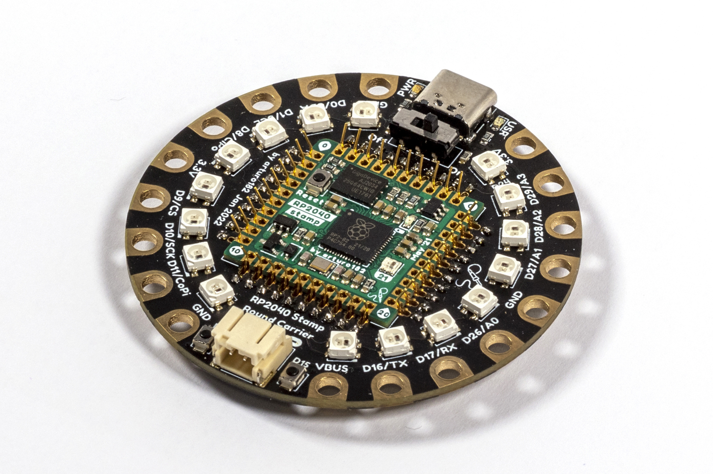

# The RP2040 Stamp Round Carrier

The RP2040 Stamp Round Carrier is a reference design for the RP2040 Stamp as well as a full-fledged round RP2040 dev board.
The HW files for the Stamp can be found here: https://github.com/solderparty/rp2040_stamp_hw

The Carrier comes with a combo 3-in-1 SMD/TH/FlexyPin Stamp footprint, you can solder the Stamp directly to the Carrier, use 2mm pin headers + sockets to be able to plug it in and out, or use FlexyPins to pop the Stamp in and out of the Carrier would soldering the Stamp. This way the Carrier also acts as a great Stamp flashing and testing jig.

On top of all the functionality of the Stamp, the Carrier also adds:
* A ring of 16 Neopixels
* Combo 3-in-1 Stamp footprint (SMD/TH/FlexyPin)
* Sewing (conductive thread) and alligator clip-friendly pads
* An on/off switch
* 3.7/4.2V LiPo connector
* USR LED
* Power (3.3V) LED
* Two user buttons
* USB Type-C connector

# Links

For more information visit https://rp2040-stamp.solder.party/